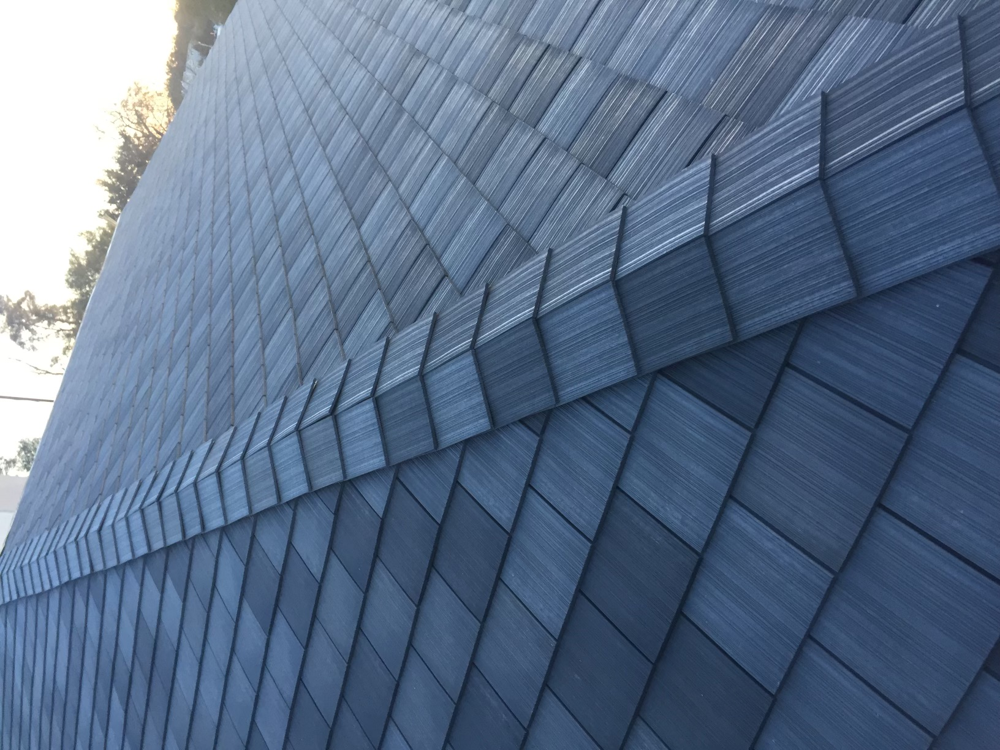
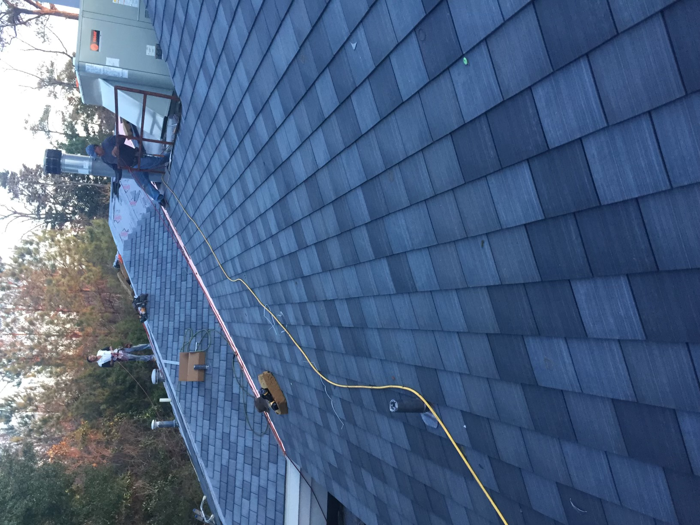
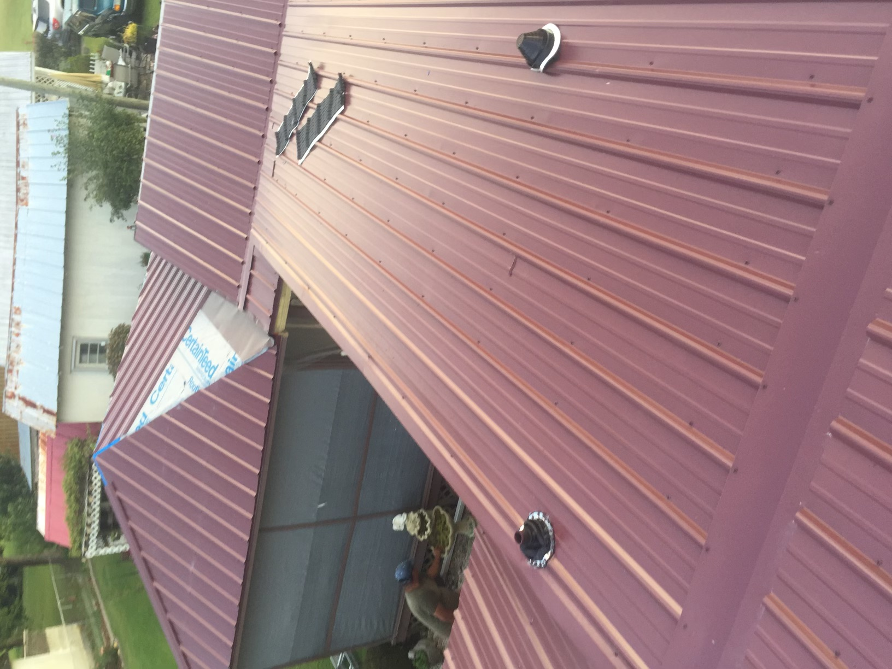
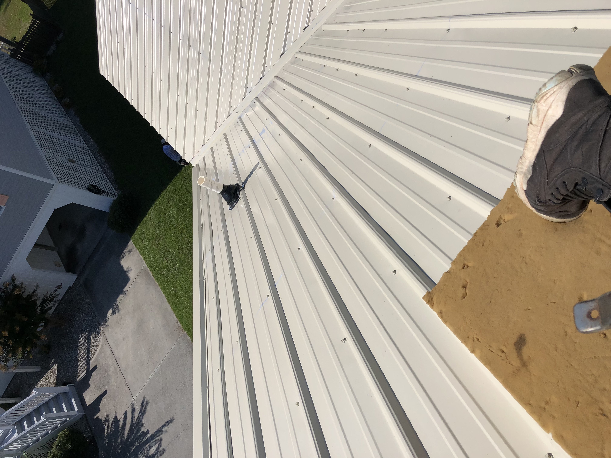
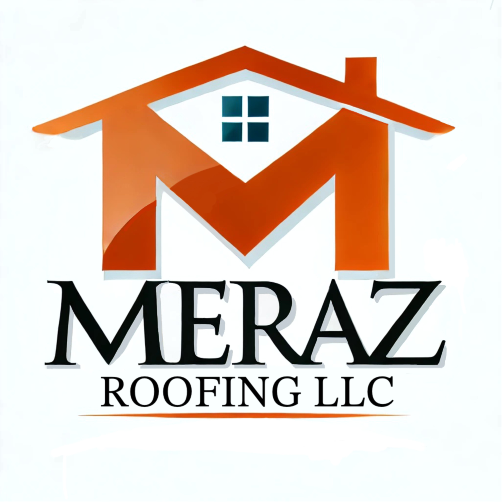

# 🏠 Meraz Roofing LLC

Professional, reliable, and high-quality roofing services you can trust.

---

## 📌 Overview

Welcome to the official repository for **Meraz Roofing LLC**.

This project contains the source code for a modern, responsive roofing company website built to showcase roofing services, improve online visibility, build customer trust, and generate leads across Eastern North Carolina.

The website includes:
- A fully responsive homepage
- Dedicated service pages
- SEO optimization
- Mobile-friendly navigation
- Contact and estimate request forms
- Service call-to-action sections
- Optimized images and branding assets

---

## 🌎 Service Areas

Meraz Roofing LLC proudly serves:

- Jacksonville, NC
- Wilmington, NC
- Hampstead, NC
- Richlands, NC
- New Bern, NC
- Mount Olive, NC

---

## 🔧 Services

### Basic Roofing Repair

Our Basic Roofing Repair service is designed for fast, reliable repairs that help protect your home and extend the life of your roof without unnecessary costs.

**Includes:**
- Leak repairs
- Missing shingles
- Flashing repairs
- Storm damage fixes
- Preventative maintenance

---

### Intermediate Roofing Solutions

Our Intermediate Roofing Solutions provide enhanced durability and long-term performance for residential roofing systems.

**Includes:**
- Partial roof replacement
- Structural reinforcement
- Upgraded materials
- Ventilation improvements
- Weather-resistant protection

---

### Advanced Complete Roof Replacement

Our Advanced Complete Roof Replacement service uses modern roofing systems and premium materials that meet current industry standards for durability, protection, and curb appeal.

**Includes:**
- Full roof tear-off and replacement
- High-quality shingles and materials
- Deck inspection and repair
- Long-term protection systems
- Complete installation services

---

## 🖼️ Project Gallery

### Homepage Hero



---

### Services Section

<p float="left">
  
  
  
</p>

---

### About Section



---

## 📁 Project Structure

```plaintext
meraz-roofing/
│
├── index.html
├── styles.css
├── basic-roofing-repair.html
├── intermediate-roofing-solutions.html
├── advanced-roof-replacement.html
│
├── images/
│   ├── hero.jpeg
│   ├── hero.webp
│   ├── basic-repair.jpeg
│   ├── basic-repair.webp
│   ├── intermediate-solutions.jpeg
│   ├── intermediate-solutions.webp
│   ├── roof-replacement.jpeg
│   ├── roof-replacement.webp
│   ├── about.jpg
│   ├── about.webp
│   └── favicon/
│       └── favicon.ico
```

---

## ✨ Features

- Fully responsive design
- Mobile-friendly navigation
- Scroll-hide sticky header
- Dedicated service pages
- Optimized service cards
- SEO-friendly metadata
- Structured Schema.org data
- Contact and estimate request form
- Click-to-call and text functionality
- Optimized image loading with WebP support
- Clean modern UI/UX
- Cross-device compatibility

---

## 🛠️ Technologies Used

- HTML5
- CSS3
- Responsive Design
- Flexbox
- CSS Grid
- Formspree Contact Forms
- Google Fonts

---

## 🚀 Getting Started

### 1. Clone the Repository

```bash
git clone https://github.com/your-username/meraz-roofing.git
```

### 2. Open the Project

Open `index.html` in your preferred browser.

---

## 📱 Responsive Design

The website is optimized for:

- Desktop devices
- Tablets
- Mobile phones
- Modern web browsers

---

## 📬 Contact

### Website
https://merazroofing.com

### Phone
(910) 380-8027

### Email
info@merazroofing.com

---

## 📄 License

This project is proprietary and owned by **Meraz Roofing LLC**.

Unauthorized reproduction or redistribution is prohibited.

---

## © 2026 Meraz Roofing LLC

All rights reserved.
